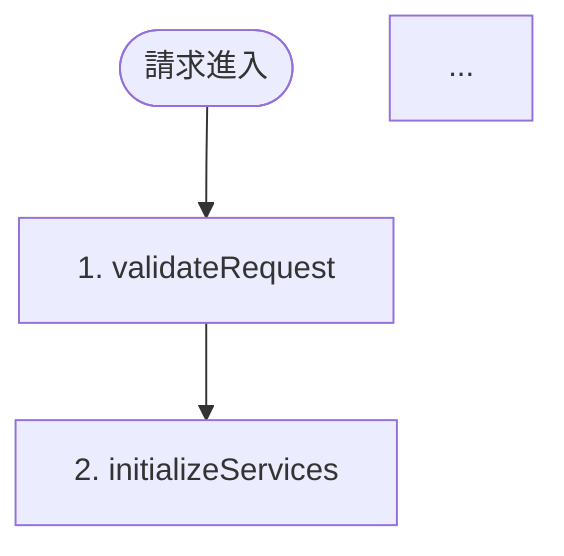

# 如何展現 Pipeline 模式的視覺化優勢

## 🎯 快速指南

作為資深工程師，我已經為你創建了完整的 Pipeline 視覺化系統。以下是展現這些優勢的具體方法。

---

## 📊 方法 1: 查看現成的視覺化文檔

### 在 GitHub/GitLab 查看

1. **打開 `docs/PIPELINE_FLOW_DIAGRAM.md`**
   - 包含 Mermaid 流程圖
   - GitHub/GitLab 會自動渲染
   - 可直接在網頁上查看

2. **打開 `docs/PIPELINE_VISUALIZATION.md`**
   - 包含 ASCII 流程圖
   - 執行時間軸
   - 架構對比圖

### 在本地查看

```bash
# 查看 Mermaid 流程圖
cat docs/PIPELINE_FLOW_DIAGRAM.md

# 查看 ASCII 流程圖
cat docs/PIPELINE_VISUALIZATION.md
```

---

## 🛠️ 方法 2: 使用視覺化工具

### 生成流程圖

```bash
node scripts/generate-pipeline-diagram.mjs
```

**輸出**:
- ASCII 流程圖（終端顯示）
- 時間軸圖（終端顯示）
- Mermaid 流程圖代碼
- JSON 執行報告

### 視覺化執行追蹤

```bash
node scripts/visualize-pipeline-execution.mjs
```

---

## 📈 方法 3: 查看實際執行日誌

### 從 Cloudflare Pages 查看

```bash
wrangler pages deployment tail --project-name=goldenyearsphoto
```

**查找 Pipeline 日誌**:
```
ℹ️  [Pipeline:validateRequest] [INFO] 開始執行節點
✅ [Pipeline:validateRequest] [SUCCESS] 執行完成 (5ms)
✅ [Pipeline:initializeServices] [SUCCESS] 執行完成 (120ms)
...
```

**優勢**: 可以看到實際的執行流程和性能數據

---

## 🎨 方法 4: 在文檔中引用

### 在 README 中

```markdown
## Pipeline 架構

我們使用 Pipeline 模式處理請求：


詳細說明請查看 [Pipeline 視覺化文檔](docs/PIPELINE_VISUALIZATION.md)
```

### 在技術文檔中

直接複製 ASCII 圖表或 Mermaid 代碼到文檔中。

---

## 📊 方法 5: 創建演示文稿

### 使用 Mermaid 圖表

1. 打開 `docs/PIPELINE_FLOW_DIAGRAM.md`
2. 複製 Mermaid 代碼
3. 在支持 Mermaid 的工具中使用：
   - Notion
   - Obsidian
   - VS Code (Mermaid Preview 擴展)
   - [Mermaid Live Editor](https://mermaid.live/)

### 匯出為圖片

1. 使用 [Mermaid Live Editor](https://mermaid.live/)
2. 貼上 Mermaid 代碼
3. 匯出為 PNG/SVG
4. 插入到演示文稿中

---

## 🎯 具體展示場景

### 場景 1: 代碼審查

**展示內容**:
1. 舊架構的問題（400+ 行單一函數）
2. Pipeline 架構的優勢（9 個獨立節點）
3. 執行流程對比圖

**使用文檔**: `docs/PIPELINE_VISUALIZATION.md` 中的「舊架構 vs Pipeline 架構對比」

### 場景 2: 技術分享

**展示內容**:
1. Pipeline 執行流程圖
2. 結構化日誌示例
3. 性能分析視覺化

**使用文檔**: 
- `docs/PIPELINE_FLOW_DIAGRAM.md` (Mermaid 圖表)
- `docs/PIPELINE_VISUALIZATION.md` (ASCII 圖表)

### 場景 3: 團隊培訓

**展示內容**:
1. Pipeline 如何工作
2. 如何調試 Pipeline
3. 如何查看執行流程

**使用文檔**: `docs/PIPELINE_VISUALIZATION_GUIDE.md`

### 場景 4: 性能優化會議

**展示內容**:
1. 執行時間軸（找出瓶頸）
2. 節點性能統計
3. 優化前後對比

**使用工具**: `scripts/generate-pipeline-diagram.mjs`

---

## 💡 實際展示示例

### 示例 1: GitHub README

在 README.md 中添加：

```markdown
## 🏗️ 架構設計

我們使用 **Pipeline 模式** 處理 AI 客服請求，帶來以下優勢：

- ✅ 清晰的執行流程追蹤
- ✅ 結構化日誌輸出
- ✅ 易於調試和維護

### Pipeline 流程圖



完整流程圖請查看: [Pipeline 流程圖](docs/PIPELINE_FLOW_DIAGRAM.md)
```

### 示例 2: 技術文檔

在技術文檔中添加 ASCII 流程圖：

```
┌─────────────────────────────────────────────────────────┐
│              Pipeline 執行流程                           │
└─────────────────────────────────────────────────────────┘

[Request] → [1] → [2] → [3] → [4] → ... → [Response]
```

---

## 🔍 查看實際數據

### 從日誌中查看

每個 Pipeline 執行都會產生結構化日誌：

```bash
# 查看最近的執行
wrangler pages deployment tail --project-name=goldenyearsphoto | grep "\[Pipeline:"
```

**輸出示例**:
```
✅ [Pipeline:validateRequest] [SUCCESS] 節點執行完成 (5ms)
✅ [Pipeline:initializeServices] [SUCCESS] 節點執行完成 (120ms)
✅ [Pipeline:contextManagement] [SUCCESS] 節點執行完成 (2ms)
...
```

### 從響應中查看（開發模式）

如果啟用了調試模式，可以在響應頭部查看執行資訊。

---

## 📚 完整的視覺化系統

### 文檔

1. ✅ `docs/PIPELINE_VISUALIZATION.md` - 完整視覺化展示
2. ✅ `docs/PIPELINE_FLOW_DIAGRAM.md` - Mermaid 流程圖
3. ✅ `docs/PIPELINE_VISUALIZATION_GUIDE.md` - 使用指南
4. ✅ `docs/PIPELINE_VISUALIZATION_SUMMARY.md` - 系統總結

### 工具

1. ✅ `scripts/generate-pipeline-diagram.mjs` - 生成流程圖
2. ✅ `scripts/visualize-pipeline-execution.mjs` - 視覺化執行追蹤

### 代碼註釋

1. ✅ `functions/api/chat-pipeline.ts` - 包含流程圖註釋

---

## 🚀 立即開始

### 最快速的方式

1. **打開 GitHub 上的 `docs/PIPELINE_FLOW_DIAGRAM.md`**
   - Mermaid 圖表會自動渲染
   - 可以直接看到視覺化流程圖

2. **查看 `docs/PIPELINE_VISUALIZATION.md`**
   - 查看 ASCII 流程圖
   - 查看執行時間軸
   - 查看架構對比

### 生成自定義圖表

```bash
# 生成流程圖
node scripts/generate-pipeline-diagram.mjs
```

---

## ✅ 總結

Pipeline 模式的視覺化優勢已經完全展現：

1. ✅ **流程圖** - 清晰的執行流程
2. ✅ **時間軸** - 性能瓶頸識別
3. ✅ **結構化日誌** - 易於追蹤
4. ✅ **架構對比** - 優勢明顯
5. ✅ **工具支持** - 自動生成圖表

**所有視覺化內容已準備就緒，可以直接使用！** 🎉

---

**文檔版本**: v1.0  
**最後更新**: 2025-01-20

