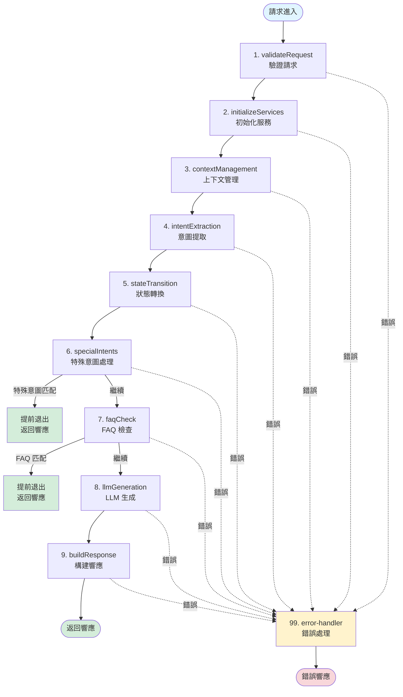
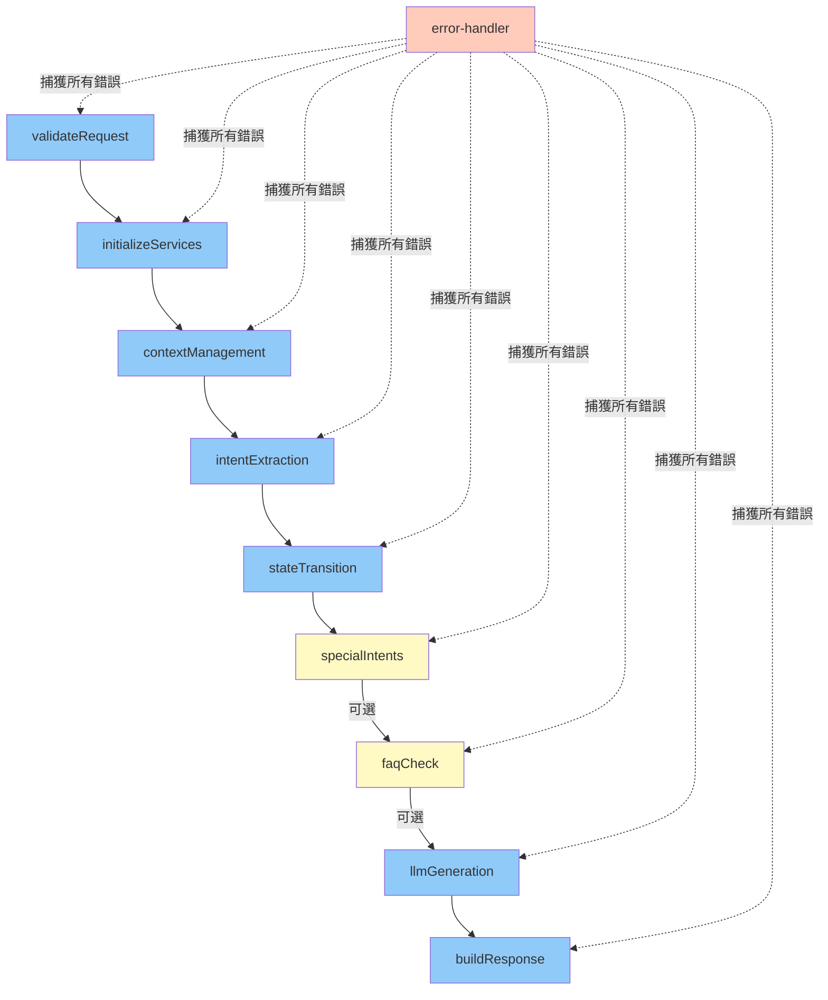
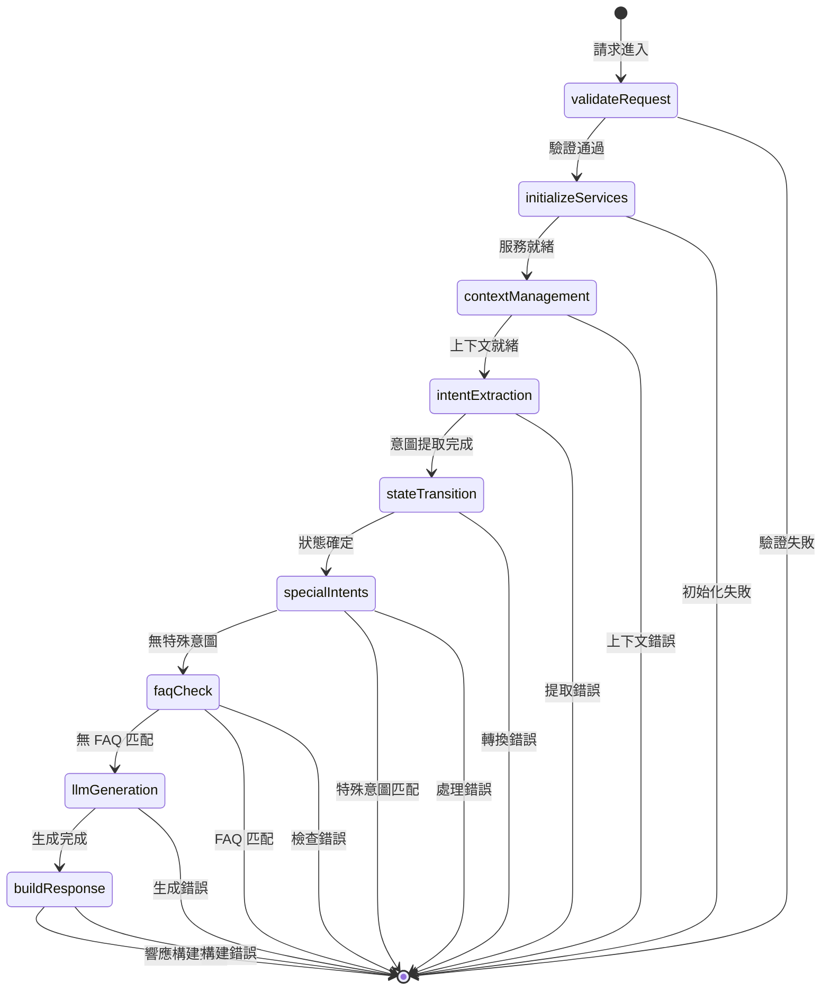
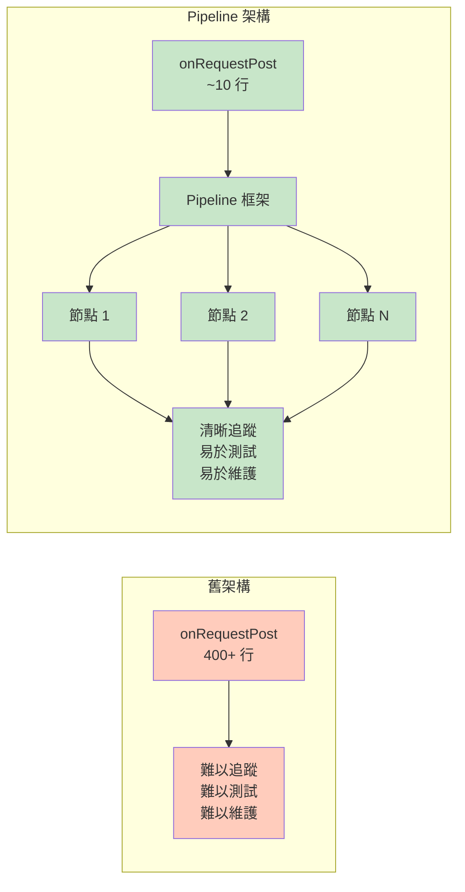
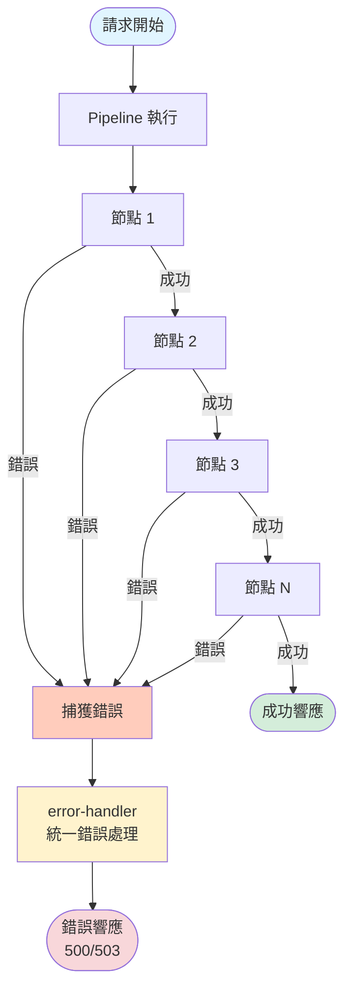

# Pipeline 執行流程圖（Mermaid 格式）

## 🎨 Mermaid 流程圖

這些流程圖可以在支持 Mermaid 的平台（如 GitHub、GitLab、Notion）直接渲染。

---

## 1. 完整執行流程

---

## 2. 數據流圖

```mermaid
flowchart LR
    Request[Request] --> V[validateRequest]
    V -->|ctx.body<br/>ctx.corsHeaders| I[initializeServices]
    I -->|ctx.knowledgeBase<br/>ctx.llmService<br/>ctx.contextManager| C[contextManagement]
    C -->|ctx.conversationContext| E[intentExtraction]
    E -->|ctx.intent<br/>ctx.entities<br/>ctx.mergedEntities| S[stateTransition]
    S -->|ctx.nextState| SP[specialIntents]
    SP -->|可能返回 Response| FAQ[faqCheck]
    FAQ -->|可能返回 Response| L[llmGeneration]
    L -->|ctx.reply| B[buildResponse]
    B --> Response[Response]
    
    style Request fill:#e1f5ff
    style Response fill:#d4edda
```

---

## 3. 執行時間軸

```mermaid
gantt
    title Pipeline 執行時間軸
    dateFormat X
    axisFormat %L ms
    
    section 請求處理
    validateRequest :0, 5
    initializeServices :5, 125
    contextManagement :125, 127
    intentExtraction :127, 135
    stateTransition :135, 138
    specialIntents :138, 139
    faqCheck :139, 141
    llmGeneration :141, 1941
    buildResponse :1941, 1944
```

---

## 4. 節點依賴關係

---

## 5. 狀態轉換流程

---

## 6. 舊架構 vs Pipeline 架構對比

---

## 7. 錯誤處理流程

---

## 📊 使用這些圖表

### 在 GitHub/GitLab

直接在 Markdown 文件中使用，平台會自動渲染。

### 在 Notion

1. 創建代碼塊
2. 選擇語言為 `mermaid`
3. 貼上上述代碼

### 在其他平台

1. 使用 [Mermaid Live Editor](https://mermaid.live/)
2. 匯出為 PNG/SVG
3. 插入到文檔中

---

**這些視覺化圖表清晰展示了 Pipeline 模式的優勢！** 🎉

